# dsh-skins — Skin pack for DSH Web

[](../../releases)
[](../../actions/workflows/ci.yml)
[](./LICENSE)
[](#faq)

English · [中文](./README.md)

Hot-swappable brand skins for DeepSeek Harness Web — with a one-click path back to the official interface.

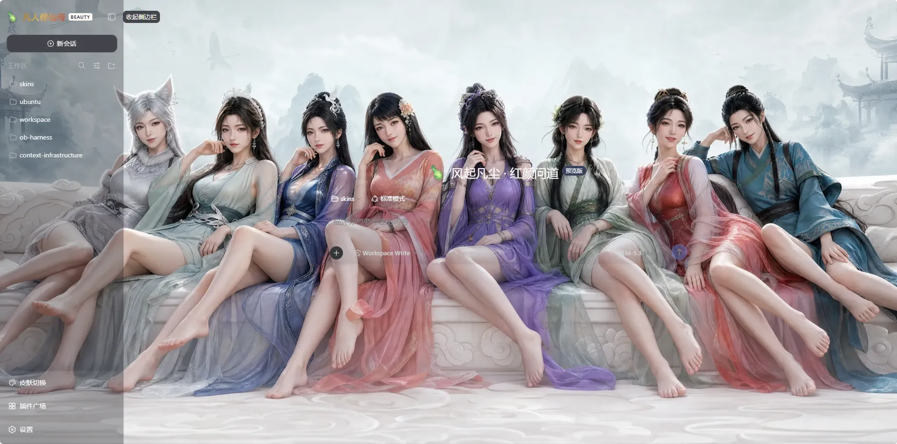

## Up and running in 30 seconds

This section answers: how to install, how to switch skins.

```sh
dsh plugin --profile web add github:iasiv5/skins#main
```

1. Run the install command above.
2. Restart DSH Web (for example `systemctl restart` the matching service, depending on your deployment).
3. Refresh the page.
4. Click **Skin Switcher** at the bottom of the sidebar and pick a skin.

On a fresh install with no saved choice, 美人志 (meirenzhi, "Mortal's Journey · Beauty Chronicle") is the factory-default skin. For reproducible installs, use a tag from [Releases](../../releases) or pin a reviewed 40-character commit SHA:

```sh
dsh plugin --profile web add github:iasiv5/skins#<commit-sha>
```

Update and uninstall:

```sh
dsh plugin --profile web update dsh-skins    # update
dsh plugin --profile web remove dsh-skins    # uninstall
```

<details>
<summary>Hand the install to your Agent (prompt install)</summary>

Copy the whole block below to an Agent inside DSH Web:

```text
Install the DSH skin plugin dsh-skins for me:
1. Run: dsh plugin --profile web add github:iasiv5/skins#main
2. Once it succeeds, restart DSH Web (if it runs under systemd, restart the service).
3. Remind me to refresh the page afterwards.
If the install fails, send me the command output verbatim and retry at most once.
```

</details>

## Five appearances

This section answers: which skins exist and what each feels like.

| Choice ID | Kind | Description |
|---|---|---|
| `official` | built-in option | Plain paper & dark ink · breathing white space · naturally itself |
| `meirenzhi` | full skin · factory default | Jade faces & flowered looks · moonlit silks by night · asking the Dao in mortal dust |
| `openbmc` | full skin | Ice-silk waves · storm-wing backdrop · ice-blue palette |
| `uefi-harness` | full skin | Violet spark · sunset wash · indigo-blue palette |
| `tgcf` | full skin | A thousand lights · vermilion & gold · night shared bright |

- `official` restores the official DeepSeek Harness branding, backdrop and favicon, while keeping the skin switcher and the official light/dark palettes.
- `meirenzhi` (凡人修仙传 · A Mortal's Journey: Beauty Chronicle) is an **unofficial fan work** with no affiliation with or authorization from the copyright holders; the 12 bundled wallpapers are AI-generated fan art, the Reach-for-the-Sky Vial site icon embeds the owner-provided emblem artwork, the BEAUTY badge is rendered with HTML/CSS, and the fireflies use CSS pseudo-elements and radial gradients — no official artwork is bundled. Vermilion-and-gold in both light and dark, slogan "From mortal dust, immortals bloom" (风起凡尘 · 红颜问道).
- `openbmc` (OpenBMC Harness): the brand slots reuse the OpenBMC project's official logo letterforms and blue-green brand gradient, used solely for identification; all rights remain with the OpenBMC project. The backdrop is the "Left Wind, Right Thunder" storm artwork, ice-blue in both light and dark, slogan "Govern before the storm" (察于未萌 · 治于未乱).
- `uefi-harness` (UEFI Harness): the brand slots carry the UEFI Forum's official logo (rights note under "Known limits"). The backdrop is the "Integrated Circuits" circuit-board artwork, violet-and-indigo in both light and dark, slogan "Boot before everything" (启于固件 · 行于万象).
- `tgcf` (Heaven Official's Blessing · No Taboos) is an **unofficial fan work** with no affiliation with or authorization from the copyright holders; the factory wallpapers are AI-generated fan art, while the site icon and drifting-butterfly decoration are original code-drawn SVG — no official artwork is bundled. Vermilion-and-gold dark mode, pale-gold light mode, slogan "No Taboos".
- Every skin ships one palette per light/dark mode and follows the appearance setting automatically.

## Screenshots

All captures below are real browser screenshots covering all four extension skins, new and old alike; every wallpaper can be swapped any time from the personalization panel (next section).

### 凡人修仙传 · 美人志 (factory default)

| | |
|---|---|
|  | 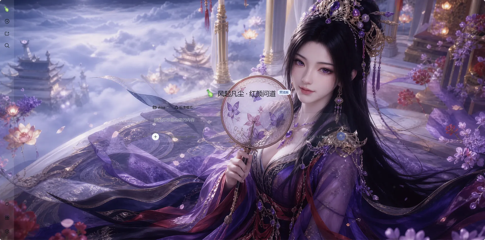 |
| 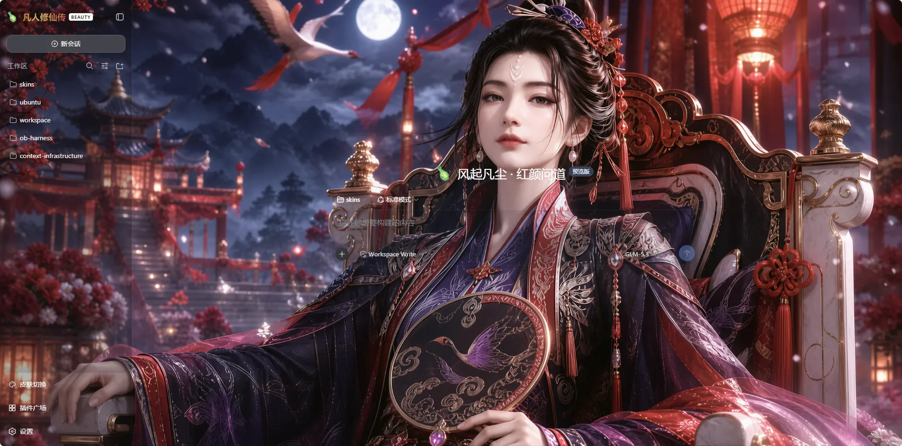 | 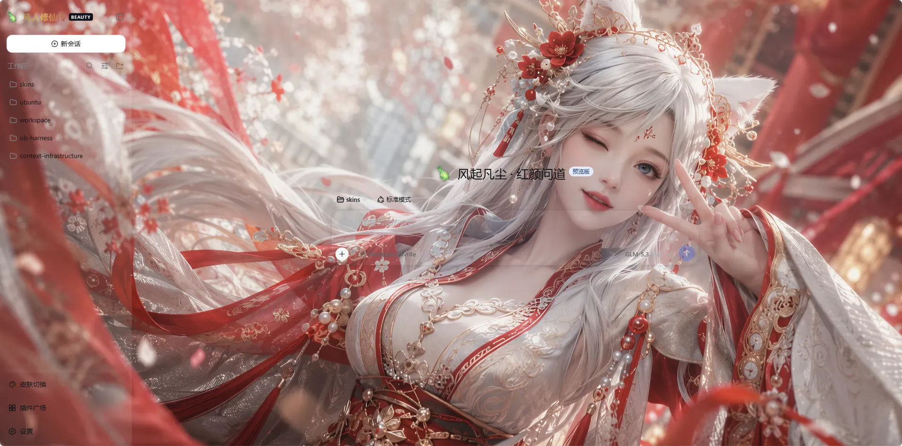 |
| 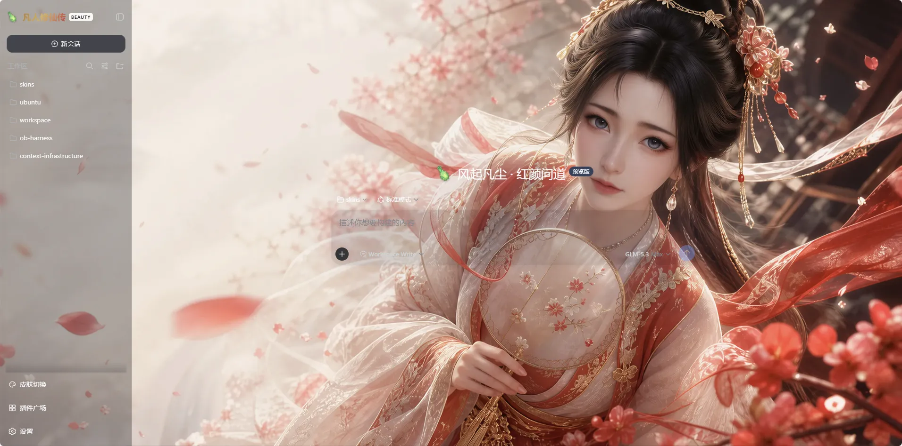 | 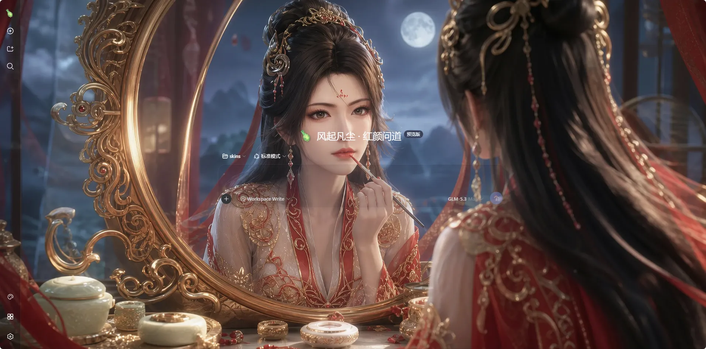 |

Solo portraits in order: Ziling, Nangong Que (dark), Yinyue, Mu Peiling and Nangong Wan; the first shot is the factory wallpaper "Yuntai Gathering" (group).

### 天官赐福 · No Taboos

| | |
|---|---|
| 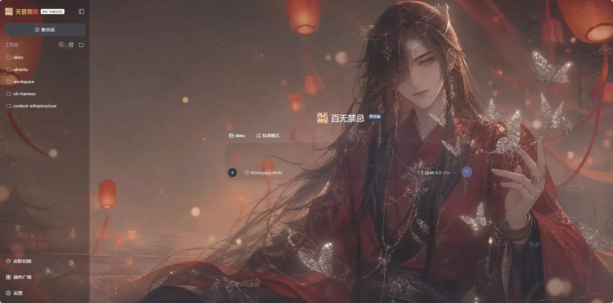 | 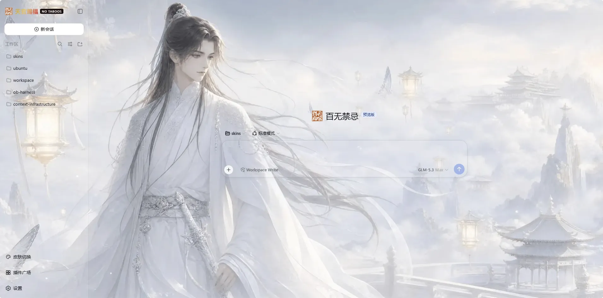 |

### OpenBMC Harness

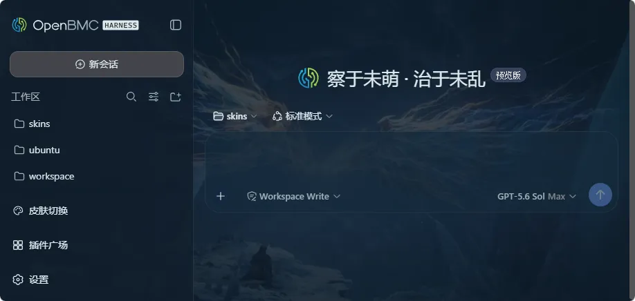

### UEFI Harness

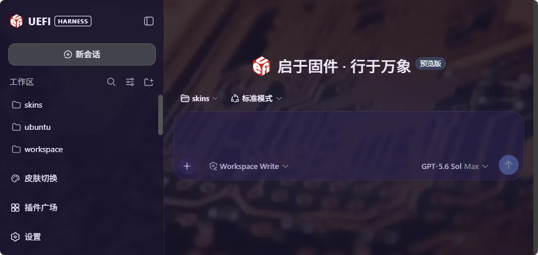

## Personalization: wallpaper, slogan and translucency

This section answers: what you can tune, how, and where the settings live.

Every skin's key visuals are open to adjustment. Click the gear button on a skin card and that skin's personalization panel docks beside the switcher (stacked vertically on narrow windows). All four skins (`tgcf` / `openbmc` / `uefi-harness` / `meirenzhi`) share the same field set:

| Field | What you can do | Factory value |
|---|---|---|
| **Wallpaper** | Pick from the skin's built-in artwork, or upload your own images into a personal library | Each skin's default artwork |
| **Slogan** | The new-session guidance line, one Chinese and one English copy | The skin's factory slogan |
| **Translucency** | 0–100%, one value driving three visual layers: panel tint, wallpaper scrim and blur. 0% is pure, fully visible wallpaper; 100% hides it completely | tgcf / meirenzhi 35, openbmc / uefi-harness 55 |

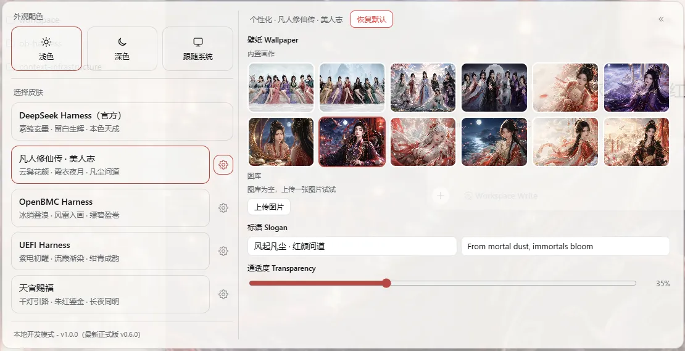

### Upload your own wallpaper (personal library)

- PNG / JPEG / WebP / GIF are accepted: ≤ 20MB each, GIF ≤ 12MP; animated WebP and SVG are rejected.
- Multi-select is supported — files upload one by one, each announcing its progress and any failure reason.
- The library has no count cap and is shared by all skins.
- Deleting a referenced image, or clearing the library, lists every affected skin and field first and acts only after you confirm.

### Every change applies and persists on its own

- Any change in the panel applies immediately and is written automatically after a brief (~0.5s) debounce.
- Two tabs sync within about a second; while offline, write controls disable themselves so edits are never lost silently.
- Reset-to-default is the one guarded action: it lists the settings it will reset, and after you confirm it returns to factory values and persists automatically.
- While the panel is open, clicking another skin's card moves the panel straight to that skin's settings.

### Where settings live, and whether they survive

- Configuration and the library live under `$DSH_HOME/dsh-skins/`, physically isolated from the plugin install directory: upgrades, rollbacks and one-click updates cannot touch them.
- Only overrides are stored: untouched fields automatically follow the new version's defaults, and leftovers of retired fields are cleaned up at load.
- A damaged state file triggers recovery mode: indexes are rebuilt and bad files quarantined — your images are never wiped.
- Uploads pass magic-number validation and size caps; concurrent writes merge per field and never clobber each other.

## The skin switcher

This section answers: what lives in the switcher and how to use it.

The **Skin Switcher** popover at the bottom of the sidebar has two sections:

1. **Appearance**: Light, Dark, System. It calls the official theme service and stays in sync with Settings → General → Appearance.
2. **Choose Skin**: the first entry is DeepSeek Harness (Official), followed by the extension skins. Clicking switches instantly and persists the choice; the popover stays open for continuous preview.

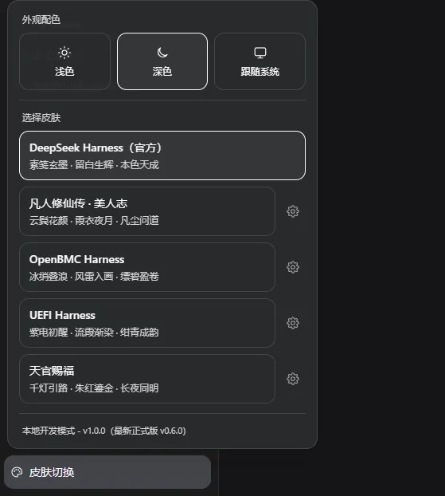

When the sidebar is collapsed, the entry folds into a round palette icon; multiple `sidebar.footer.action` entries stack vertically without overlapping. Choosing "Official" only undoes the extension skins — your light/dark/system preference is untouched.

The URL switches skins too: `/?skin=official`, `/?skin=meirenzhi`, `/?skin=openbmc`, `/?skin=uefi-harness`, `/?skin=tgcf`.

## One-click updates and the security design

This section answers: how updates work, and why it is safe to let the plugin install them.

Opening the skin switcher makes the Host check the latest stable Release of this repository; when a newer version exists, the update row shows the current version, the latest version and a release-notes link:

1. Click **Update**; download, install and verification run automatically.
2. Click **Restart now** (or **Later**); the new version takes effect after the restart.
3. Running Agents block the restart; retry once they finish.

Every step is verified in code, not on trust:

- only strict `vX.Y.Z` stable tags are accepted, resolved to a full 40-character commit SHA;
- the remote package name, repository and `package.json` version must all agree;
- the actual install is pinned to that SHA, never drifting with a branch;
- after installing, the profile and the installed package are re-verified; any failure restores the previous version automatically;
- under service managers such as systemd, the restart is handed back to the unit's `Restart` policy instead of killing the process.

> The update module ships from `v0.4.0`. On older installs, run `dsh plugin --profile web update dsh-skins` once manually; one-click updates work from then on.

## FAQ

**How do I get fully back to the official interface?**
Pick "DeepSeek Harness (Official)" in the skin switcher, or open `/?skin=official`. It undoes the extension skin's branding, backdrop and favicon while keeping the switcher and the official light/dark palettes; your light/dark/system preference stays untouched.

**What happens when an update fails?**
Updates follow a "back up first, then install" transaction: any verification failure automatically restores the previous version, and the popover shows the failure reason (in Chinese and English). If it still fails, update manually with `dsh plugin --profile web update dsh-skins`.

**Which DSH Web versions are supported?**
Verified with DSH Web `0.1.1-rc.2`. Later rc builds of the same series are expected to work, but unverified versions carry no promise.

**Does my appearance preference sync across browsers?**
In the browser on the DSH host machine (loopback), the preference is persisted by the DSH Host and shared naturally. Other remote browsers keep the preference in their own `localStorage` — independent per browser, never overwritten.

**Do personalization settings survive upgrades?**
Yes. Configuration and the library live in the `$DSH_HOME/dsh-skins/` data directory; self-updates only replace the plugin install directory and physically cannot touch it — rollbacks preserve it too. Only disk-level damage can lose configuration, and even then recovery mode keeps the library images.

## Known limits

- Other skin plugins may also touch the body backdrop, brand slots or favicon; avoid enabling multiple visual skin plugins at the same time.
- The `openbmc` brand slots reuse the OpenBMC project's official logo letterforms and brand gradient, used solely for identification; all rights remain with the OpenBMC project.
- The `uefi-harness` mark is the UEFI Forum's official trademark (the red cube, from uefi.org's published uefi_logo_red.gif, embedded as vector paths traced via Wikimedia Commons "Logo of the UEFI Forum.svg"); it is used solely to identify the skin, and all rights remain with the UEFI Forum.
- `tgcf` is an unofficial fan work: its name and imagery reference "Heaven Official's Blessing" with no affiliation with or authorization from the copyright holders (MXTX, bilibili, et al.); all bundled visuals are original drawings and no official artwork is included. Should a rights holder object, the skin will be republished under a neutral name (e.g. "A Thousand Lights · Vermilion & Gold").

## License

[MIT](./LICENSE)

---

Want to read the source, build your own skin, or contribute? See [docs/developers.md](./docs/developers.md) (how it works, skin authoring guide, local verification and the debug API).
