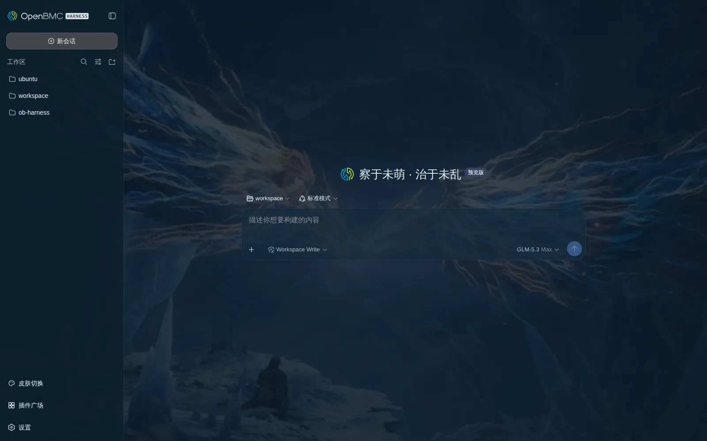
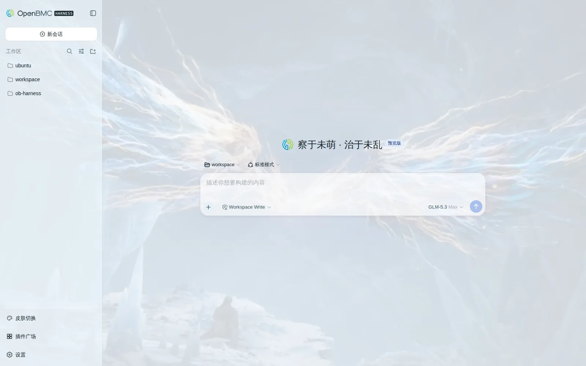
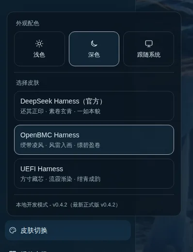

# dsh-skins — Skin pack for DSH Web

[](../../releases)
[](../../actions/workflows/ci.yml)
[](./LICENSE)
[](#faq)

English · [中文](./README.md)

Hot-swappable brand skins for DeepSeek Harness Web — with a one-click path back to the official interface.



## Up and running in 30 seconds

This section answers: how to install, how to switch skins.

```sh
dsh plugin --profile web add github:iasiv5/skins#main
```

1. Run the install command above.
2. Restart DSH Web (for example `systemctl restart` the matching service, depending on your deployment).
3. Refresh the page.
4. Click **Skin Switcher** at the bottom of the sidebar and pick a skin.

On a fresh install with no saved choice, OpenBMC is the default skin. For reproducible installs, use a tag from [Releases](../../releases) or pin a reviewed 40-character commit SHA:

```sh
dsh plugin --profile web add github:iasiv5/skins#<commit-sha>
```

Update and uninstall:

```sh
dsh plugin --profile web update dsh-skins    # update
dsh plugin --profile web remove dsh-skins    # uninstall
```

<details>
<summary>Hand the install to your Agent (prompt install)</summary>

Copy the whole block below to an Agent inside DSH Web:

```text
Install the DSH skin plugin dsh-skins for me:
1. Run: dsh plugin --profile web add github:iasiv5/skins#main
2. Once it succeeds, restart DSH Web (if it runs under systemd, restart the service).
3. Remind me to refresh the page afterwards.
If the install fails, send me the command output verbatim and retry at most once.
```

</details>

## Four appearances

This section answers: which skins exist and what each feels like.

| Choice ID | Kind | Description |
|---|---|---|
| `official` | built-in option | DeepSeek mark · default backdrop · brand palette |
| `openbmc` | full skin | Ribbon mark · storm-wing backdrop · ice-blue palette |
| `uefi-harness` | placeholder skin | Cube mark · gilded backdrop · violet-blue palette |
| `tgcf` | full skin | A thousand lights · vermilion & gold · night shared bright |

- `official` restores the official DeepSeek Harness branding, backdrop and favicon, while keeping the skin switcher and the official light/dark palettes.
- `openbmc` is the default skin. "Official" only means restoring the official interface; it is not the first-load choice.
- Every skin ships one palette per light/dark mode and follows the appearance setting automatically:



- `uefi-harness` is a placeholder skin: the architecture and interactions come first, the brand slots carry the UEFI Forum's official logo, a gilded circuit-board photo serves as the backdrop, and the final design lands later.
- `tgcf` (Heaven Official's Blessing · No Taboos) is an **unofficial fan work** with no affiliation with or authorization from the copyright holders; the factory wallpapers are AI-generated fan art (made with Doubao, provided by the plugin author), while the site icon and drifting-butterfly decoration remain original code-drawn SVG — no official artwork is bundled. Vermilion-and-gold dark mode, pale-gold light mode, slogan "No Taboos".


## Personalization

This section answers: what each skin exposes, where settings live, and when edits take effect.

Every skin card carries a gear button that docks that skin's personalization panel beside the switcher (stacked vertically on narrow windows):

- **Customizable fields** (one standard field set across all three skins: `tgcf` / `openbmc` / `uefi-harness`): wallpaper (built-in artwork + a personal library), slogan (zh/en), panel translucency (0–100%; one value jointly drives the panel tint, the wallpaper scrim and the blur — 0% is pure, fully visible wallpaper, 100% fully hides it; each skin's default anchors its factory look — tgcf 30%, openbmc/uefi 55%). Colours, the site icon and the tab title are fixed skin design and no longer adjustable.
- **Personal library**: upload PNG / JPEG / WebP / GIF (≤ 20MB each, GIF ≤ 12MP; animated WebP and SVG are rejected). Multi-select is supported — files upload one by one with progress and per-file failure reasons — and the library has no count cap. Shared by all skins; deleting a referenced image or clearing the library lists every affected skin and field first.
- **Auto-save**: every change in the panel (wallpaper, slogan, panel translucency) applies immediately and persists automatically after a brief debounce — field changes need no save button and no confirmation; Reset-to-default is the one guarded action — it lists the settings it will reset and asks before applying, then persists automatically. Same click-to-apply experience as switching skins. While the panel is open, clicking another skin's card moves the panel to that skin.
- **Storage & upgrades**: configuration and the library live under `$DSH_HOME/dsh-skins/` (isolated from the plugin install directory), so upgrades / rollbacks / one-click updates preserve them by construction; only overrides are stored, and new defaults flow to untouched fields; leftovers of retired fields are cleaned up at load.
- **Safety design**: uploads pass magic-number validation and size caps; a damaged state file triggers recovery mode (rebuilds the library, never deletes images); concurrent field-level writes never clobber each other (last write wins per field).

## The skin switcher

This section answers: what lives in the switcher and how to use it.



The **Skin Switcher** popover at the bottom of the sidebar has two sections:

1. **Appearance**: Light, Dark, System. It calls the official theme service and stays in sync with Settings → General → Appearance.
2. **Choose Skin**: the first entry is DeepSeek Harness (Official), followed by the extension skins. Clicking switches instantly and persists the choice; the popover stays open for continuous preview.

When the sidebar is collapsed, the entry shows as a round palette icon. Choosing "Official" only undoes the extension skins — your light/dark/system preference is untouched. Multiple `sidebar.footer.action` entries stack vertically instead of overlapping.

The URL switches skins too: `/?skin=official`, `/?skin=openbmc`, `/?skin=uefi-harness`, `/?skin=tgcf`. The choice is stored in `localStorage["dsh-skins:active"]`.

Console debug API:

```js
__DSH_SKINS__.list();                  // list extension skins, excluding official
__DSH_SKINS__.select("official");      // restore the official interface
__DSH_SKINS__.active();                // currently selected id
__DSH_SKINS__.themePreference();       // appearance saved by this browser; may be null
```

## One-click updates and the security design

This section answers: how updates work, and why it is safe to let the plugin install them.

Opening the skin switcher makes the Host check the latest stable Release of this repository. When a newer version exists, the update row shows the current/latest versions and a release-notes link:

1. Click **Update**; download, install and verification run automatically.
2. Click **Restart now** (or **Later**); the new version takes effect after the restart.
3. Running Agents block the restart; retry once they finish.

Why it is safe — every step is verified in code, not on trust:

- only strict `vX.Y.Z` stable tags are accepted, resolved to a full 40-character commit SHA;
- the remote package name, repository and `package.json` version must all agree;
- the actual install is pinned to that SHA, never drifting with a branch;
- after installing, the profile and the installed package are re-verified; any failure restores the previous version automatically;
- under service managers such as systemd, the restart is handed back to the unit's `Restart` policy instead of killing the process.

> The update module ships from `v0.4.0`. On older installs, run `dsh plugin --profile web update dsh-skins` once manually; one-click updates work from then on.

## How it works

This section is for people reading the source: how the plugin is built and how the update transaction lands.

**Two-ended design**. The client owns the skins and the switcher UI; the Host owns Release checks, safe installs and restarts. esbuild produces `lib/client.js` and `lib/index.js`, and both artifacts are committed — a GitHub install never builds on the target machine.

**The update transaction** (Host):

- Check results are cached in `$DSH_HOME/dsh-skins/update-cache.json` with a one-hour TTL that survives DSH restarts. When already up to date, no update row appears; on network failure you can retry manually at the bottom of the popover.
- The install source is re-checked before updating. Only installs from the official GitHub repository may update online: `link:` installs show "local development mode" with online updates disabled; `file:`, tarballs and other repositories are never overwritten.
- After installation the profile pin, bundle registration and installed metadata are verified; any failure automatically restores the pre-update GitHub install.
- Restart safety: running Agents are detected and block the restart; under a service manager (detected via `INVOCATION_ID`/`NOTIFY_SOCKET`) the process exits non-zero to hand the restart to the `Restart` policy; the built-in detach-and-relaunch helper runs only outside service managers.

**Theme persistence**. In non-loopback browsers the plugin listens to the official `theme/change` event, stores light/dark/system in `localStorage["dsh-skins:theme-preference"]`, and restores it through the official `theme.setTheme()` on startup. Loopback browsers skip this fallback and use DSH's own Host persistence.

**Localized errors**. Every Host error that reaches the UI carries a stable machine code plus template params; the client renders the localized text from them and falls back to the raw Host message for unknown codes.

## Build your own skin

This section answers: how to add a skin of your own.

Export a factory from `src/client/skins/<id>/index.js`:

```js
export function createMySkin({ jsx }) {
  function Mark({ size = 24 }) { /* return the mark */ }
  function Name() { /* return the wordmark */ }

  return {
    id: "my-skin",
    label: "My Skin",
    description: { zh: "一句话描述", en: "One-line description" },
    bodyAttr: "dshMySkin",
    Mark,
    Name,
    favicon: "data:image/svg+xml,...",
    faviconMime: "image/svg+xml",
    title: "My Skin",
    css: `body[data-dsh-my-skin] { /* DSH tokens */ }`,
    art: "",
    scrimLight: "",
    scrimDark: "",
    placeholderLight: "linear-gradient(...) light",
    placeholderDark: "linear-gradient(...) dark",
    slogans: { zh: "中文标语", en: "English slogan" },
  };
}
```

Then:

1. add the matching import and `runtime.register(...)` call in `src/client/index.js`;
2. declare the skin's fields (`fields[]` plus built-in assets) in `src/shared/personalization/catalog.js` — the personalization panel then appears automatically, driven by five field types (`text / color / image / select / range`) and three value scopes (`single / locale / colorScheme`);
3. provide a pure `project(values, assets)` function on the skin factory when you need custom value→effects mapping; without one, the built-in adapter keeps byte-for-byte legacy behaviour;
4. reverse both when removing a skin;
5. keep the id `official` and the compatibility alias `default` reserved — never for extension skins.

`label` and `description` accept either a locale-neutral string (brand names) or a `{ zh, en }` map, resolved as active locale → en → zh. Skin cards and `__DSH_SKINS__.list()` always report resolved strings, and `tests/dicts.test.mjs` keeps the zh/en dictionaries key- and placeholder-complete in both directions.

`title` (optional) rebrands the browser tab's product segment — the same string or `{ zh, en }` shapes as `label`. The official `DocumentTitle` projector keeps the tab at `<session> — DeepSeek Harness`; while a skin is mounted only the product segment is swapped (the session name stays), and the official brand returns when the official appearance is selected or the plugin unmounts.

Each skin directory owns its mark, favicon, CSS, backdrop and slogans, and must not import visual assets from other skin directories; `runtime.js` and `sidebar-switcher.js` carry the shared mechanics only.

## Local development and verification

This section answers: how to run it, and how to keep the artifacts clean.

```sh
pnpm install
pnpm run check     # build + syntax checks + smoke test + full test suite
pnpm run watch     # watch src/, rebuilding lib/client.js and lib/index.js
```

- The client bundle hot-reloads through DSH HMR; Host sources, `package.json`, `cordis.patch.yml` or dependency changes still require a DSH Web restart.
- Commit sources together with the regenerated `lib/` artifacts. CI re-runs the checks, verifies the artifacts are unchanged and inspects the install package.
- Re-shoot the documentation screenshots with `node scripts/capture-previews.mjs`. The script enforces the privacy protocol: collapse every workspace, frame a fresh empty session, force the Chinese UI — no session content ever leaks.
- The two READMEs (zh/en) are paired by a verification script; change one side and you must bring the other along — see `README.i18n.yaml`.

Development install (live-link the local checkout; client edits are visible immediately):

```sh
dsh plugin --profile web add link:<path-to-this-repo>
```

## FAQ

**How do I get fully back to the official interface?**
Pick "DeepSeek Harness (Official)" in the skin switcher, or open `/?skin=official`. It undoes the extension skin's branding, backdrop and favicon while keeping the switcher and the official light/dark palettes; your light/dark/system preference stays untouched.

**What happens when an update fails?**
The update transaction backs up before it installs. Any verification failure automatically restores the previous version, and the popover shows the failure reason (in Chinese and English). If it still fails, update manually with `dsh plugin --profile web update dsh-skins`.

**Which DSH Web versions are supported?**
Verified with DSH Web `0.1.1-rc.2`. Later rc builds of the same series are expected to work, but unverified versions carry no promise.

**Does my appearance preference sync across browsers?**
In the browser on the DSH host machine (loopback), the preference is persisted by the DSH Host and shared naturally. Other remote browsers keep the preference in their own `localStorage` — independent per browser, never overwritten.

**Do personalization settings survive upgrades?**
Yes. Configuration and the library live in the `$DSH_HOME/dsh-skins/` data directory; self-updates only replace the plugin install directory and physically cannot touch it — rollbacks preserve it too. Only disk-level damage can lose configuration, and even then recovery mode keeps the library images.

## Known limits

- The OpenBMC user-bubble outline relies on the version-specific class `.gdEzaW_bubble`; if that class changes, only the outline is affected — the token palette keeps working.
- The tab-title rebrand depends on the official `DocumentTitle` projector's fixed copy `DeepSeek Harness` and its ` — ` separator; if that projector changes, only the tab product segment is affected — the rest of the interface keeps working.
- Brand slogans are swapped through the current DSH locale dictionary interface and restored on unmount; re-review after DSH locale upgrades.
- Other skin plugins may also touch the body backdrop, brand slots or favicon; avoid enabling multiple visual skin plugins at the same time.
- The `uefi-harness` mark is the UEFI Forum's official trademark (the red cube, from uefi.org's published uefi_logo_red.gif, embedded as vector paths traced via Wikimedia Commons "Logo of the UEFI Forum.svg"); it is used solely to identify the skin, and all rights remain with the UEFI Forum.
- `tgcf` is an unofficial fan work: its name and imagery reference "Heaven Official's Blessing" with no affiliation with or authorization from the copyright holders (MXTX, bilibili, et al.); all bundled visuals are original drawings and no official artwork is included. Should a rights holder object, the skin will be republished under a neutral name (e.g. "A Thousand Lights · Vermilion & Gold").

## License

[MIT](./LICENSE)
